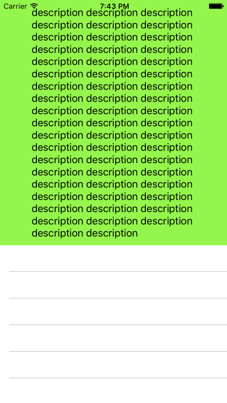

# TableHeaderView

This extension `UITableView+HeaderView` is used for resizing the height of tableHeaderView to fit content with autolayout.



## Usage

```objc
tableView.sizeHeaderToFit()
```

## Installation

* Only need to drag `UITableView+HeaderView.swift` into Project Navigator of your application's Xcode project.

## Author

Kiet Nguyen - iOS blogger at http://vankiet.com/

## License

TableHeaderView is available under the MIT license. See the LICENSE file for more info.
